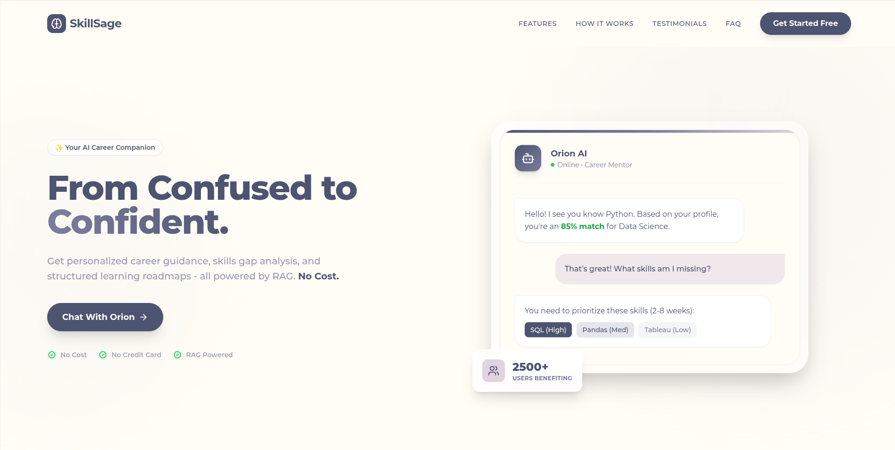
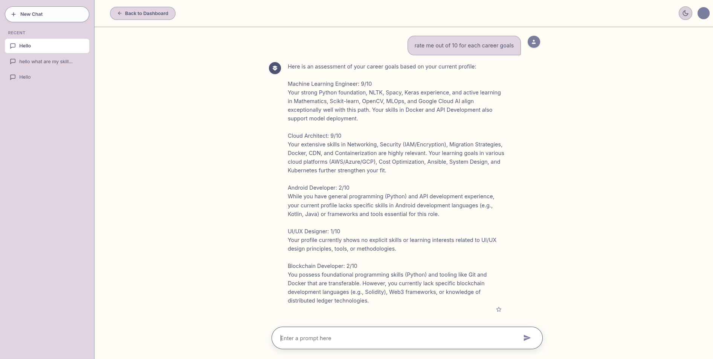
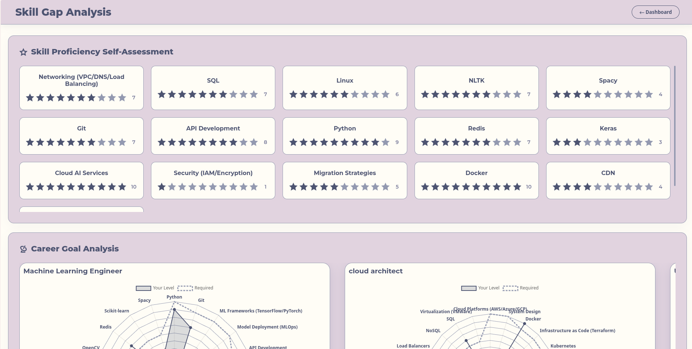
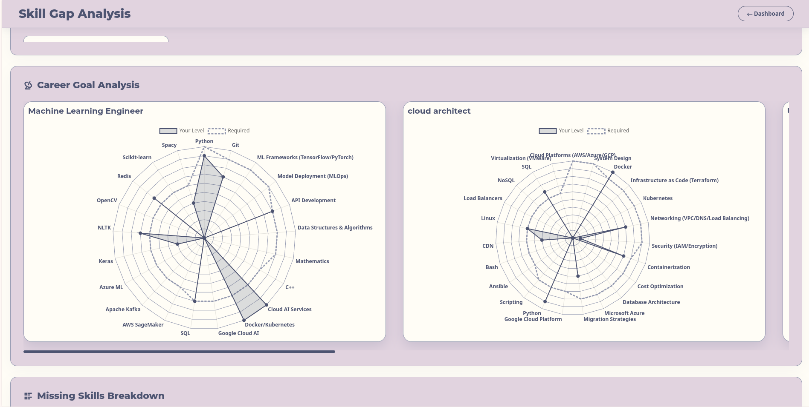
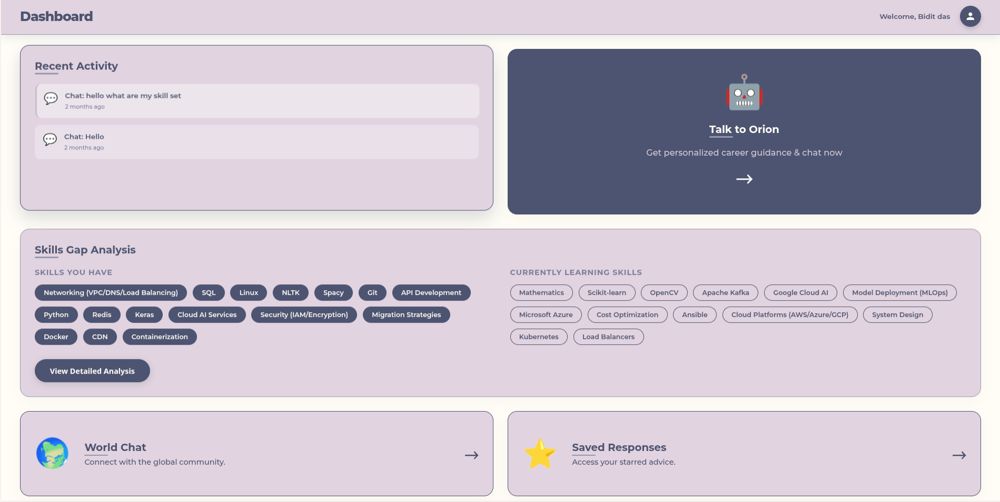
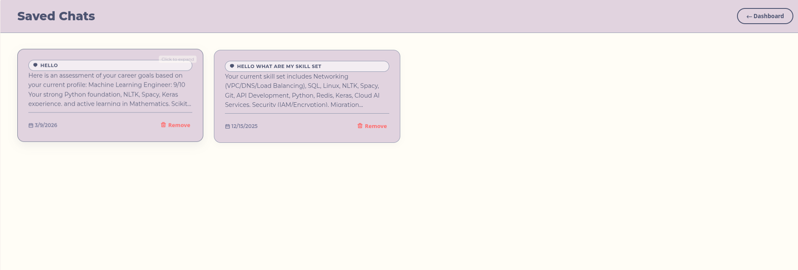

# 🧠 SkillSage — From Confused to Confident.

> **Your AI-powered career companion.** Get personalized career guidance, identify skill gaps, and follow structured learning roadmaps — all for free, powered by RAG.



[](https://opensource.org/licenses/MIT)
[](https://www.python.org/)
[](https://fastapi.tiangolo.com/)
[](https://www.trychroma.com/)
[](https://motor.readthedocs.io/)

---

## 🌟 What is SkillSage?

SkillSage is an intelligent career advisory platform that transforms the way people navigate their professional journeys. At its core, it combines a **RAG-powered AI advisor (Orion)**, a comprehensive career database of **105 career paths**, and a **110+ skill library** to deliver hyper-personalized guidance — whether you are a college student choosing your first career, a professional planning a transition, or a self-learner trying to stay on track.

The platform goes beyond generic advice. By analyzing your actual skill profile, learning goals, and career aspirations, SkillSage tells you *exactly* which skills you are missing, how long it will take to learn them, and which resources to use. No hallucinations, no random advice — just data-driven insights grounded in a curated knowledge base.

---

## ✨ Features

### 🤖 AI Career Advisor — Meet Orion

Orion is a 24/7 conversational AI mentor built on a Retrieval-Augmented Generation (RAG) architecture. It draws from a curated database of career paths, skill definitions, and FAQs to provide context-aware, accurate responses — not generic chatbot filler.



Orion supports multi-turn conversations with full history, file uploads (resumes, documents, images), and profile-aware responses. You can ask it anything from *"How do I become a Data Scientist?"* to *"Rate my profile for each of my career goals"* and receive a structured, honest assessment.

### 📊 Skills Gap Analysis

The Skills Gap Analysis page gives you a side-by-side view of where you stand versus where you need to be. Each skill in your profile is rated using a 1–10 proficiency system, and radar charts map your current level against what industry roles actually require.





Missing skills are broken down by priority (High / Medium / Low) with estimated learning timelines (2–8 weeks per skill), so you always know what to tackle next.

### 🗺️ Personalized Learning Roadmaps

For three major tracks — **Data Science** (6 months), **Full Stack Development** (4–6 months), and **DevOps Engineering** (5–6 months) — SkillSage provides weekly-milestone roadmaps with project-based learning checkpoints and curated resource links. Progress tracking is built in, so you can mark milestones as complete and visualize your journey over time.

### 📈 Interactive Dashboard

The dashboard is your mission control. It surfaces your top career matches with match scores, a real-time skills gap summary, recent chat activity, and a quick-access button to Orion — all in one place.



### 💬 Saved Chats & World Chat

Every conversation with Orion is automatically saved and can be revisited, renamed, or deleted at any time.



The **World Chat** feature is a real-time global community room where users can connect, share experiences, and support each other's career journeys.


### 💼 Career & Skills Database

The platform is backed by a curated database of **105 career paths** spanning Tech & Engineering, Data & AI, Design, Business, Marketing, and Healthcare. Every career entry includes required skills, India-specific salary ranges, job demand levels, common tools, and a career progression path. The companion **110+ skill library** provides definitions, difficulty levels, use cases, and recommended learning resources for every skill.

---

## 🏗️ Project Requirements

Before setting up SkillSage, make sure you have the following installed and ready on your machine.

| Requirement | Version | Purpose |
|---|---|---|
| Python | 3.12+ | Core runtime for the backend |
| [uv](https://docs.astral.sh/uv/) | Latest | Fast Python package & environment manager |
| MongoDB | Cloud (Atlas) or Local | Stores user profiles, chat history, and sessions |
| Google Gemini API Key | — | Powers the Orion AI advisor |

> **Why `uv`?** This project uses `uv` instead of traditional `pip` for dependency management. It is significantly faster and handles virtual environments automatically using the `pyproject.toml` file. If you do not have it installed, run `pip install uv` first.

**Hardware Recommendations:**
- Minimum 4 GB RAM (8 GB recommended for smooth local embedding generation)
- A stable internet connection is required for Gemini API calls

---

## 📦 Dependencies

All dependencies are declared in `pyproject.toml` and managed via `uv`. There is no separate `requirements.txt` — `uv` reads directly from the project file.

```toml
[project]
name = "skillsage"
version = "0.1.0"
requires-python = ">=3.12"
dependencies = [
    "argon2-cffi>=25.1.0",            # Secure password hashing
    "chromadb>=1.3.5",                # Local vector database for RAG
    "fastapi[all,standard]>=0.123.1", # Web framework + utilities
    "google-genai>=1.52.0",           # Google Gemini AI SDK
    "google-generativeai>=0.8.5",     # Google Generative AI client
    "jinja2>=3.1.6",                  # Server-side HTML templating
    "motor>=3.7.1",                   # Async MongoDB driver
    "passlib[bcrypt]>=1.7.4",         # Password hashing utilities
    "pillow>=12.0.0",                 # Image processing for file uploads
    "pymongo[srv]>=4.15.4",           # MongoDB connection with SRV support
    "python-dotenv>=1.2.1",           # Load environment variables from .env
    "python-multipart>=0.0.20",       # File upload support for FastAPI
    "sentence-transformers>=5.1.2",   # Text embeddings for RAG pipeline
    "uvicorn[standard]>=0.38.0",      # ASGI server to run FastAPI
]
```

---

## 🚀 Getting Started

Follow these four steps in order and the application will be up and running in under 10 minutes.

### Step 1 — Set Up Your Environment Variables

In the root of the project, open the `.env` file and fill in your two required credentials:

```env
GOOGLE_API_KEY = "your_google_gemini_api_key_here"
MONGO_URL      = "your_mongodb_connection_string_here"
```

**How to get these values:**

- **GOOGLE_API_KEY** → Visit [Google AI Studio](https://aistudio.google.com/app/apikey), sign in with your Google account, and create a free API key.
- **MONGO_URL** → If you are using [MongoDB Atlas](https://www.mongodb.com/cloud/atlas), create a free cluster, click **Connect → Drivers**, and copy the connection string. Remember to replace `<password>` with your actual database password.

> ⚠️ Never commit your `.env` file to GitHub. It is already listed in `.gitignore` to keep your credentials safe.

---

### Step 2 — Install Dependencies

From the project root, run the following single command. `uv` will automatically create a virtual environment and install everything defined in `pyproject.toml`:

```bash
uv sync
```

No manual `venv` creation or `pip install` is needed. Once complete, a `.venv` folder will appear in the project root — that is your isolated environment, ready to go.

---

### Step 3 — Build the Vector Knowledge Base

This is a **one-time setup step** that only needs to be repeated if you update the underlying data files. SkillSage's RAG pipeline relies on ChromaDB to store embedded representations of all career paths, skills, and FAQs. Run the ingestion script to populate it:

```bash
uv run python ingest_data.py
```

This script reads the JSON files from the `temp datasets/` folder, generates text embeddings using Sentence Transformers, and saves everything to the local `skillsage_chroma_db/` directory. The process typically takes 1–3 minutes on first run.

---

### Step 4 — Start the Application

You are now ready to launch. Start the development server with:

```bash
uv run uvicorn main:app --reload
```

The `--reload` flag tells the server to automatically restart whenever you change any source file — ideal for development. Open your browser and go to:

```
http://127.0.0.1:8000
```

You should see the SkillSage home page. Register an account, complete your profile, and start chatting with Orion.

---

## ▶️ Useful URLs

Once the server is running, the following URLs are available:

| URL | Description |
|---|---|
| `http://127.0.0.1:8000` | Main application (home page) |
| `http://127.0.0.1:8000/docs` | Interactive API documentation — Swagger UI |
| `http://127.0.0.1:8000/redoc` | Alternative API documentation — ReDoc |

The Swagger UI at `/docs` is particularly useful for developers who want to explore or test the API endpoints directly from the browser without writing any code.

---

## 🗂️ Project Structure

```
SKILLSAGE/
│
├── backend/                          # Core backend logic (services, helpers)
├── routes/                           # FastAPI route handlers (auth, chat, profile, etc.)
│
├── templates/                        # Jinja2 HTML templates (server-side rendered UI)
│   ├── index.html                    # Landing / home page
│   ├── auth.html                     # Login & registration
│   ├── dashboard.html                # User dashboard
│   ├── profile.html                  # Profile management
│   ├── detailed-skill-analysis.html  # Skills gap analysis view
│   ├── saved-chats.html              # Saved chat history
│   └── world-chat.html               # Global community chat
│
├── temp datasets/                    # Source JSON data for knowledge base ingestion
│   ├── careers_dataset.json          # 105 career path definitions
│   ├── skills_dataset.json           # 110+ skill definitions
│   ├── skills_mapping.json           # Skill-to-career mapping
│   ├── roadmap_dataset.json          # Learning roadmap data
│   └── seed_data.json                # FAQ and seed content
│
├── skillsage_chroma_db/              # Auto-generated ChromaDB vector store (do not edit manually)
│
├── main.py                           # Application entry point & router registration
├── rag_pipeline.py                   # RAG retrieval & Gemini prompt pipeline
├── ingest_data.py                    # One-time script to embed data into ChromaDB
├── career_goals.json                 # Career goal definitions
├── skills_list.json                  # Master skills reference list
├── learning_path.json                # Learning path configurations
├── roadmap.json                      # Roadmap milestone data
├── pyproject.toml                    # Project metadata & all dependencies
├── .env                              # Environment variables (never commit this)
└── .python-version                   # Pins the Python version for uv
```

---

## 🎯 Who is SkillSage For?

SkillSage is built for anyone standing at a career crossroads — whether just starting out or looking to level up. Here is exactly who will benefit most:

- 🎓 **College Students** — Stop guessing which skills to learn. Get a structured roadmap tailored to your actual career goals before you graduate.
- 🔄 **Career Changers** — Transition into tech in 6–12 months with a clear action plan that shows precisely which gaps to close and in what order.
- 🔍 **Job Seekers & Freshers** — Understand exactly when you are job-ready through a data-driven Career Readiness Score, not just a gut feeling.
- 💼 **Working Professionals** — Target the right skills for your next promotion instead of learning whatever happens to be trending.
- 📚 **Self-Learners** — Replace random video rabbit holes with structured, milestone-based roadmaps that actually lead somewhere.
- 🚀 **Entrepreneurs & Freelancers** — Build a sellable skill set fast with a clear, time-bound learning plan for Full Stack or Data Science.
- 🏫 **Bootcamp Seekers** — Get the same personalized roadmaps and a 24/7 AI mentor for free, before investing in an expensive program.
- 👨‍👩‍👧 **Parents & Career Counselors** — Support informed career decisions with real data on job demand, salary ranges, and learning timelines.

---

## 🤝 Contributing

Contributions are welcome and encouraged. If you have an idea for a new feature, find a bug, or want to improve the documentation, please open an issue or submit a pull request. When contributing, follow the existing project structure, write clear commit messages, and add comments for any non-obvious logic — especially within the RAG pipeline in `rag_pipeline.py`.

---

## 📄 License

This project is licensed under the MIT License. See the [LICENSE](./LICENSE) file for details.

---

*Built with ❤️ by [Bidit Das](https://github.com/bidit06) — SkillSage: turning career confusion into confident action, one skill at a time.*